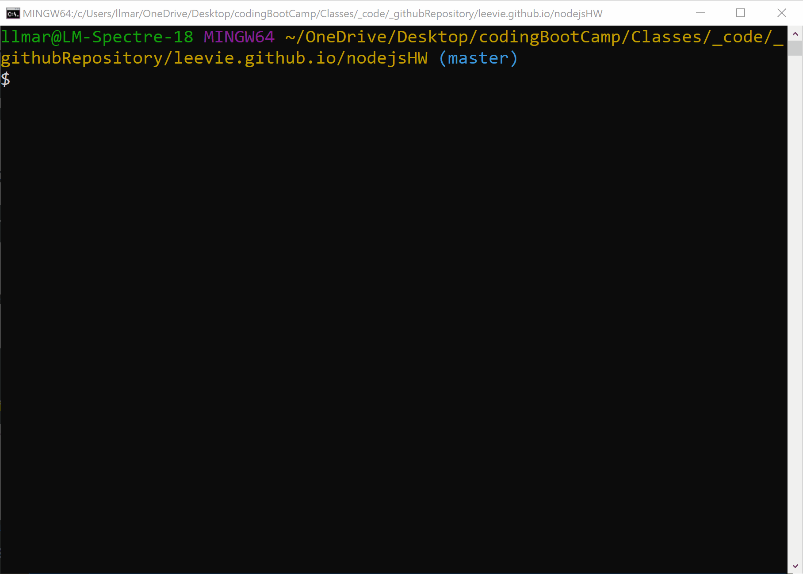
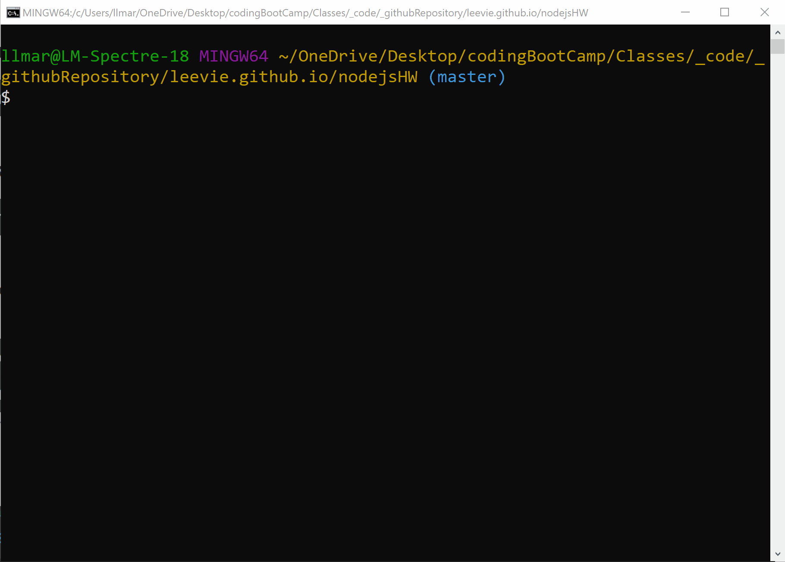
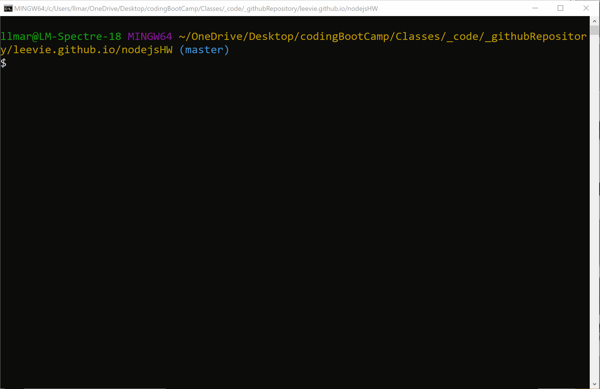

"LIRI" bot (siri-"ish" clone)
====

Welcome to my first 'NodeJS' App!  

This is a simple NodeJS app that takes in certain commands and outputs (hopefully) desired output.  

Here are the commands and syntax to use:

Call the app:  
`node liri.js` `command` `arguments`

| Command | Arguments | Description
| --- | --- | --- |
| `concert-this` | {Artist/Band Name, search-string} | **Searches for Concert Dates for a supplied Artist** |
| `spotify-this-song` | {Song Title, search-string} | **Searches for up to 10 songs with this title** |
| `movie-this` | {Movie Title, search-string} | **Searches for a movie with supplied name** |
| `do-what-it-says` | {search-string} | placeholder |

See below for examples:

## concert-this  
`concert-this` Ed Sheeran  
 

## spotify-this-song  
`spotify-this-song` A Cover is Not the Book
 

## movie-this
`movie-this` Mary Poppins Returns
 

### `do-what-it-says`  